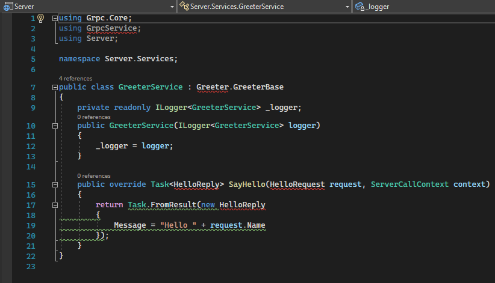
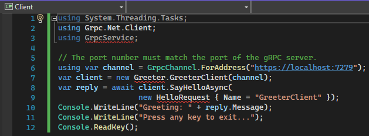

# Introduction

This project demonstrates how it's possible to share `.proto` files for a gRPC API between two .NET projects using a NuGet package. This was inspired by a comment on GitHub issue [Enable referencing proto files in NuGet packages](https://github.com/grpc/grpc-dotnet/issues/183#issuecomment-513055273).

Unfortunately, several source files will appear as if they have syntax errors when viewed in both Visual Studio 2022 and Visual Studio Code (using OmniSharp). As the code compiles this must be a bug in the tooling and I have [provided feedback to Visual Studio](https://developercommunity.visualstudio.com/t/IntelliSense-reports-false-compile-error/1468739) about this.

I based my project of the [Tutorial: Create a gRPC client and server in ASP.NET Core](https://docs.microsoft.com/en-us/aspnet/core/tutorials/grpc/grpc-start). 
A local `NuGet.Config` file is used to be able to test the NuGet package.

# Build and run

First step is to build the NuGet package:

```
dotnet build Proto
```

Then run the server:

```
dotnet run --project Server
```

In another console run the client:

```
dotnet run --project Client
```

All projects will compile and run and the gRPC API will be used in the test.

# IntelliSense problems

In Visual Studio 2022 version 17.0.1 `GrpcService.cs` in the `Server` project is displayed with IntelliSense errors:



Similarly, here is `Program.cs` in the `Client` project:



You will see the same errors in Visual Studio Code (and also Rider).

Not only are these false errors annoying to look at, they make edits hard and refactorings impossible because the editor tools will make wrong suggestions and code changes based on not being able to compile the code even though it compiles and runs just fine.